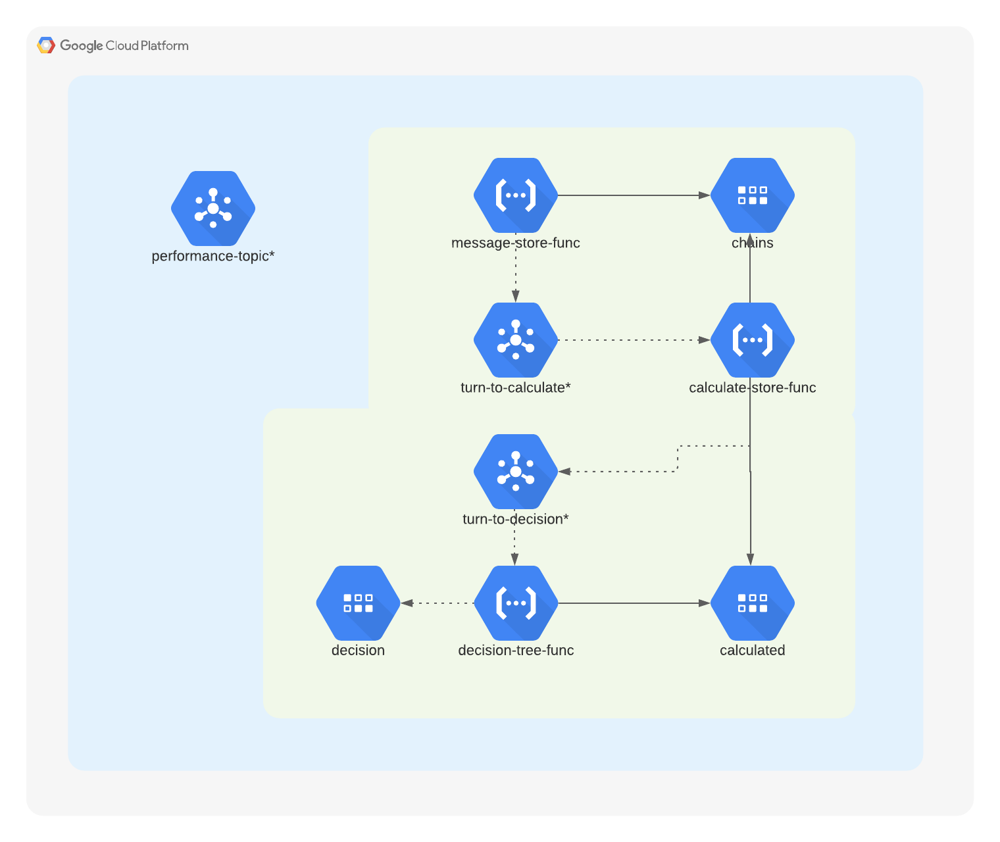

# ns-battery-pm
### Project
Ns-battery-pm is the predictive maintenance implementation for VolkerWessels Netwerk Solutions.
The project can provide the predicted remaining lifetime of a battery via its history.

```python
from enum import Enum

class Advice(Enum):
    DETERMINED = "The battery has received a prediction that it will cross the limits in {weeks}"
    UNDETERMINED = "The battery could not receive a prediction by a lack of (valid) data or invalid configuration"
```
To check whether a battery still works, batteries are drained once a week.
Depending on how fast they recharge, it can be calculated when the battery has to be replaced.
A battery that recharges slowly has to be replaced.
An equation is used to calculate how fast a battery recharges and with that equation it is calculated whether the battery should be replaced or not.

`y = ax + b`, where a = the calculated average and b = the current calculated.
y being the level at any point of x (weeks), calculated by a (growth / decline rate) + b (initial)
Implementation:

`return Advice.DETERMINED.value.format(weeks=(limit - b) / a)`
### Flow

_*ODH location/name was removed from name_.

Current implementation of the template. More information can be found on the [confluence page](https://recognize.atlassian.net/wiki/spaces/DAT/pages/3803086996/NS+Battery+Predictive+Maintenance) (internal).
### Requirements
Every function has its own requirements file.
### Template
Ns-battery-pm implements the DAT predictive maintenance template to create predictions.

First, the [Operational Data Hub](https://github.com/vwt-digital/operational-data-hub) is being used to transfer data to the specified project via Pub/Sub.
A filter function is being used to extract the correct data and remove any unwanted/unused keys. This keeps
running time for the following functions low and will decrease cost in the long run.
Ths filter function should also chain the data, and place chains in a secure location based on conditions.
These conditions can be set for each project, but should not expand the function to outside of its intended use.
A calculator function will ultimately
### Test
Run `python -m unittest test.py` in `/functions/test`

