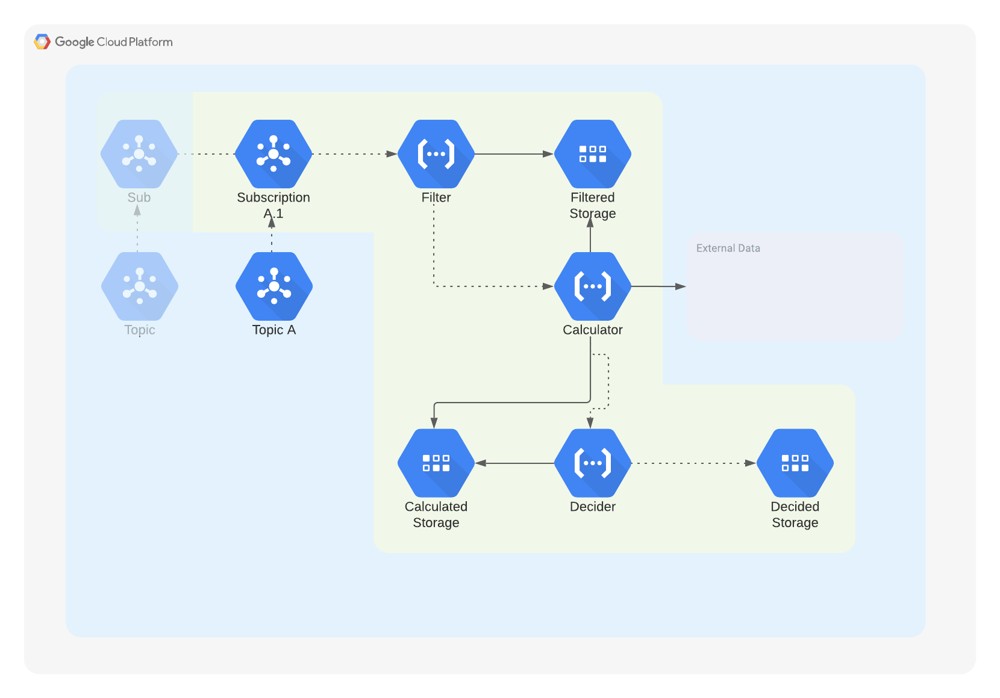

# ns-battery-pm
### Project
```python
from enum import Enum
class Advice(Enum):
    DETERMINED = "The battery has received a prediction that it will cross the limits in {weeks}"
    UNDETERMINED = "The battery could not receive a prediction by a lack of (valid) data or invalid configuration"
```
`y = ax + b`
### Flow
### Usage
### Requirements
### Template

